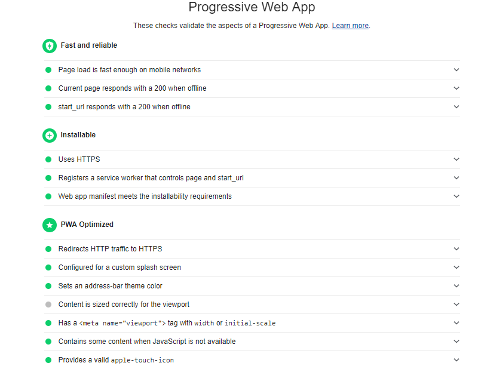

# Progrssive Web App - Starter

A simple PWA demo utilizing an app manifest, service workers and caching. 

This demo is written in plain-vanilla HTML, CSS and Javascript (ES6). 

It has no dependencies.

Workbox JS is also included.

## Demo
https://johndavemanuel.github.io/pwa-starter/

## Audits

